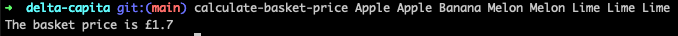

# TDD Simple Sample

Using NodeJS Javascript/TypeScript, write a simple program that calculates the price of a basket of shopping.

Items are presented one at a time, in a list, identified by name - for example "Apple" or "Banana".

Multiple items are present multiple times in the list, so for example ["Apple", "Apple", "Banana"] is a basket with two apples and one banana.
 
Items are priced as follows:

 - Apples are 35p each
 - Bananas are 20p each
 - Melons are 50p each, but are available as ‘buy one get one free’
 - Limes are 15p each, but are available in a ‘three for the price of two’ offer

Given a list of shopping, calculate the total cost of those items.

## Solution approach

I used TDD to implement this program. Thanks to it I can implement the different rules incrementaly with the simple code as possible and then easily refacto the code for better readibilty/perf etc and add other rules. I'm sure to don't break previous behaviour thanks to it.
It also bring good test coverage and document what the code does as well.

I detailed my steps in the commits history to follow my TDD journey.

I also used _TS_ with _Jest_ and _Wallaby.js_ VS Code plugin to have a quick feedback that ensure that my code goes to the right direction/intent.

I used the Node.js native `process.argv` property to implement a basic CLI.


### Additional BDD approach

Additionaly, I also added BDD approach making the spec/test more readable with BDD syntax (given, when, then) focusing on code intent/business/why/what insteaf of how.
It's a good practice especially for big use cases with a lot of rules.

## Installation

```bash
git clone git@github.com:MaximeMoreauPro/tdd-simple-sample.git
cd tdd-simple-sample
npm install
```

## Try the CLI programm 'calculate-basket-price'

```bash
npm run build
npm link
chmod +x dist/calculate-basket-price-cli.js

# call the CLI with the items as args
calculate-basket-price Apple Banana etc.
```

_CLI Sample:_



## Run the test

```bash
npm run test
```


